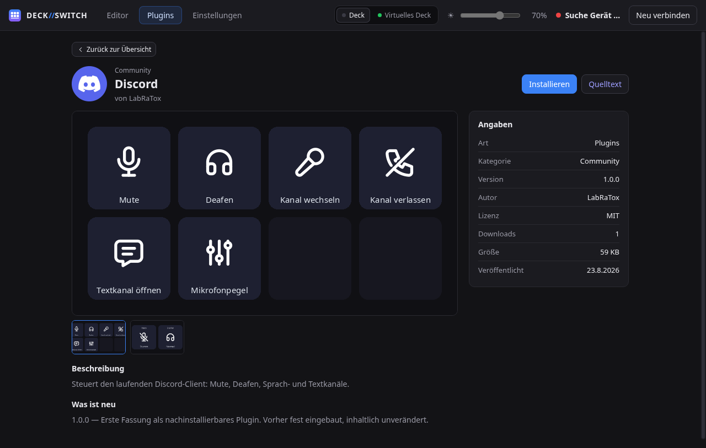

# DECK//SWITCH

**Steuerungssoftware für das Elgato Stream Deck unter Linux.** Ohne Elgatos
offizielle Software, mit eigenem Plugin-System.

*[English version](README.md)*

Entwickelt und am Gerät getestet mit dem **Stream Deck +** auf **CachyOS /
Arch Linux**, KDE Plasma unter Wayland.

Andere Desktops gehen auch. Die App schaut beim Start nach, was die laufende
Sitzung kann, und zeigt nur Aktionen an, die dort auch funktionieren. Was bei
dir fehlt und warum, steht in den Einstellungen.

| | Virtuelles Deck | Fenster steuern |
| --- | --- | --- |
| KDE Plasma (Wayland und X11) | ja | ja |
| Hyprland, Sway | ja | ja |
| XFCE, Cinnamon, MATE, i3 … (X11) | ja | nein |
| GNOME | nein | nein |

Für das virtuelle Deck braucht es unter Wayland `zwlr_layer_shell_v1`, unter
X11 die klassischen Fenster-Hinweise. Beides sorgt dafür, dass ein Klick den
Tastaturfokus nicht wegnimmt. GNOMEs Compositor kann das Protokoll nicht.
Fenster zu steuern braucht eine Schnittstelle im Compositor: Plasma, Hyprland
und Sway haben eine, GNOME hat keine.

> Der Name wird **DECK//SWITCH** geschrieben, die Schrägstriche in der
> Akzentfarbe. Technisch heißt alles `deckswitch`: Paket, Dienst,
> Konfigurationsordner.


---

## Was es kann

**Tasten und Dials**
Drei Aktionen pro Taste: Drücken, Doppeldruck, Halten. Dials regeln stufenlos
oder lösen je Drehrichtung eine eigene Aktion aus. Mehrere Belegungen können
sich einen Dial teilen (Dial-Stack). Wischen über den Touchstrip blättert
durch die Seiten.

**Seiten und Ordner**
Beliebig tiefer Seitenbaum, per Drag & Drop sortierbar. Ordner sind einfach
Unterseiten.

**Multi-Aktionen**
Mehrere Schritte nacheinander. Pausen zählen dabei als eigener Schritt, jeder
Schritt lässt sich einzeln abschalten, und das Ganze läuft auf Wunsch in der
Schleife. Dazu gibt es einen Umschalter mit zwei Ketten und eigenem Symbol je
Richtung.

**Aussehen**
Symbol, Beschriftung (Schriftart, Schnitt, Größe, Farbe, Ausrichtung) und
Hintergrund (Farbe, Verlauf, Textur, Bild) für jede Taste. Animierte GIFs
laufen auf der Taste. Für fertige Tastenbilder gibt es eine eingebaute
Werkstatt. Gezeichnet wird immer im Backend, deshalb zeigt die Vorschau genau
das, was auf dem Gerät steht.

**Mehrere Decks**
So viele Geräte gleichzeitig, wie du hast. Jedes bekommt sein eigenes Profil,
seine eigene Helligkeit und eigene Zeiten. Zugeordnet wird über die
Seriennummer.

**Virtuelles Deck**
Ein Deck als Overlay auf dem Bildschirm, mit frei wählbarem Raster. Kein
Fensterrahmen, kein Eintrag in Alt-Tab, und der Tastaturfokus bleibt, wo er
ist. Frei platzierbar, die Stelle merkt sich die App. Mit einem **globalen
Kurzbefehl** holst du es von überall her.

**Netz-Deck**
Ein Deck, das jemand anderes im selben Netz im Browser bedient, zum Beispiel
der Moderator während des Streams. Passwortgeschützt, nichts zu installieren,
und ändern kann der Gast nichts.

<p align="center">
  
  
</p>

**Bildschirmschoner und Hintergrundbilder**
Ein Motiv über alle Tasten und den Touchstrip, animiert oder still. Jede Seite
kann ihr eigenes Hintergrundbild für den Touchstrip haben.

**Plugins**
Sechs Plugins sind eingebaut: Audio, System, Soundboard, Multi-Aktion,
Navigation und der Tabler-Iconset. Fünf weitere gibt es zum Nachinstallieren:
OBS, Discord, Spotify, Wetter und ein Uhr-Bildschirmschoner. Für eigene
gibt es eine offene API. Iconsets sind ebenfalls Plugins.

Nachinstallieren geht auf vier Wegen: über den **Store** direkt in der App,
aus einer ZIP-Datei, von einer Adresse oder über einen `streamdeck://`-Link
im Browser.

**Integrierter Plugin-Store**
Er zeigt dir alle verfügbaren Plugins, auch die installierten. Noch nicht
installierte erkennst du am gestrichelten Rahmen. Ein Klick auf den Namen
öffnet die Detailseite mit Bildern, Beschreibung, Lizenz und Größe. Links
filterst du nach Thema, oben nach Art.

<p align="center">
  
  
</p>

**Einstellungen**
Sprache, Standard-Iconset, Autostart und alles zu den Decks.

<p align="center">
  
</p>

Mehr dazu: [Bedienung](docs/de/operation.md) ·
[Decks](docs/de/decks.md) · [Plugins](docs/de/plugins.md)

---

## Installation

Gedacht ist das Ganze für **CachyOS und Arch Linux**. `setup.sh` braucht
deshalb `pacman`. Auf anderen Distributionen bricht es ab und zeigt dir die
Liste der Pakete, die du selbst installieren musst.

### Als Paket bauen

Im AUR gibt es DECK//SWITCH noch nicht. Die Paketdateien liegen aber fertig
im Repo, du kannst also selbst bauen. Der Weg lohnt sich, weil das Paket die
udev-Regel und die systemd-Unit gleich dorthin legt, wo sie hingehören.
Genau das vergisst man von Hand am ehesten.

```sh
git clone https://github.com/LabRaTox/Deck-Switch.git
cd Deck-Switch/packaging/aur
makepkg -si
systemctl --user enable --now deckswitch.service
```

Danach einmal in die Gruppe `input` eintragen und neu anmelden. Die brauchst
du für die Aktionen *Tastenkombination* und *Text tippen*:

```sh
sudo usermod -aG input "$USER"
```

### Aus dem Repo

Zum Mitentwickeln, oder wenn du gar nicht erst paketieren willst:

```sh
git clone https://github.com/LabRaTox/Deck-Switch.git
cd Deck-Switch
./scripts/setup.sh          # Pakete, venv, GUI-Build, udev-Regel
./scripts/start-backend.sh  # Backend starten
```

Die Oberfläche läuft dann unter <http://127.0.0.1:8770>. Oder als eigenes
Fenster:

```sh
./scripts/start-gui.sh
```

### Pakete von Hand

`setup.sh` prüft sie selbst und bietet an, fehlende nachzuinstallieren:

```sh
sudo pacman -S --needed python webkit2gtk-4.1 base-devel rust hidapi libusb \
    nodejs npm noto-fonts wireplumber libpulse libxkbcommon pipewire-audio \
    qt6-declarative layer-shell-qt cairo
```

### Gerätezugriff (udev)

Ohne udev-Regel gehört der HID-Knoten root. Das Gerät wäre dann nur als root
ansprechbar. `setup.sh` bietet die Installation an, von Hand geht es so:

```sh
sudo install -m 644 packaging/70-streamdeck.rules /etc/udev/rules.d/
sudo udevadm control --reload-rules
sudo udevadm trigger --subsystem-match=usb --subsystem-match=hidraw
```

Danach den Stream Deck einmal ab- und wieder anstecken.

Dieselbe Regel richtet auch den Zugriff auf `/dev/uinput` ein. Darüber läuft
die virtuelle Tastatur für **Tastenkombination** und **Text tippen**. Dafür
muss dein Benutzer in der Gruppe `input` sein:

```sh
groups | grep -q input || sudo usermod -aG input "$USER"
```

Die Gruppenmitgliedschaft greift erst nach dem nächsten Anmelden. Ob es
geklappt hat, siehst du in der Oberfläche: In den Einstellungen einer
Hotkey-Aktion steht sonst im Klartext, was fehlt.

### Beim Anmelden starten

Am einfachsten über den Schalter **Beim Anmelden starten** in den
Einstellungen. Er legt den systemd-Dienst an und schaltet ihn ein oder aus.
Dasselbe von der Kommandozeile:

```sh
./scripts/install-service.sh            # einrichten
./scripts/install-service.sh --remove   # wieder entfernen
```

---

## Aufgebaut auf

| | |
| --- | --- |
| **Backend** | Python 3, [`streamdeck`](https://github.com/abcminiuser/python-elgato-streamdeck), FastAPI |
| **GUI** | Tauri + Vite/React, mit dem WebView des Systems |
| **Audio** | PipeWire über `wpctl`/`pactl`, Soundboard über `pw-play` |
| **Eingaben** | virtuelle Tastatur über `/dev/uinput`, Belegung über libxkbcommon |
| **Desktop** | MPRIS über D-Bus. Globale Kurzbefehle und Bildschirmfotos über KDE, sonst über `xdg-desktop-portal` |
| **Overlay** | `zwlr_layer_shell_v1` über layer-shell-qt, unter X11 über Fenster-Hinweise |
| **Icons** | [Tabler Icons](https://tabler.io/icons) (MIT), eingebunden als ganz normales Iconset-Plugin |

Ohne [`python-elgato-streamdeck`](https://github.com/abcminiuser/python-elgato-streamdeck)
von Dean Camera gäbe es dieses Projekt nicht. Die ganze Geräteanbindung baut
darauf auf.

## Dokumentation

Alles zweisprachig, in [`docs/de/`](docs/de/) und [`docs/en/`](docs/en/).

| | |
| --- | --- |
| [Bedienung](docs/de/operation.md) | Editor, Tastenlogik, Multi-Aktionen, Dials, Aussehen |
| [Decks](docs/de/decks.md) | mehrere Geräte, virtuelles Deck, Netz-Deck |
| [Plugins](docs/de/plugins.md) | eingebaute und nachinstallierbare, Installation |
| [Eigene Plugins schreiben](docs/de/plugin-development.md) | die Plugin-API |
| [Discord einrichten](docs/de/discord-setup.md) | einmalige Einrichtung |
| [Aufbau und Entwicklung](docs/de/development.md) | Projektstruktur, Tests, Sicherheit, Grenzen |

## Lizenz

[MIT](LICENSE) — Heiko Stuhrmann.

Die Tabler Icons stehen ebenfalls unter der MIT-Lizenz
(`backend/plugins/iconset-tabler/LICENSE`).

Dieses Projekt hat nichts mit Elgato oder Corsair zu tun. „Stream Deck" ist
eine Marke der Corsair Memory, Inc.
