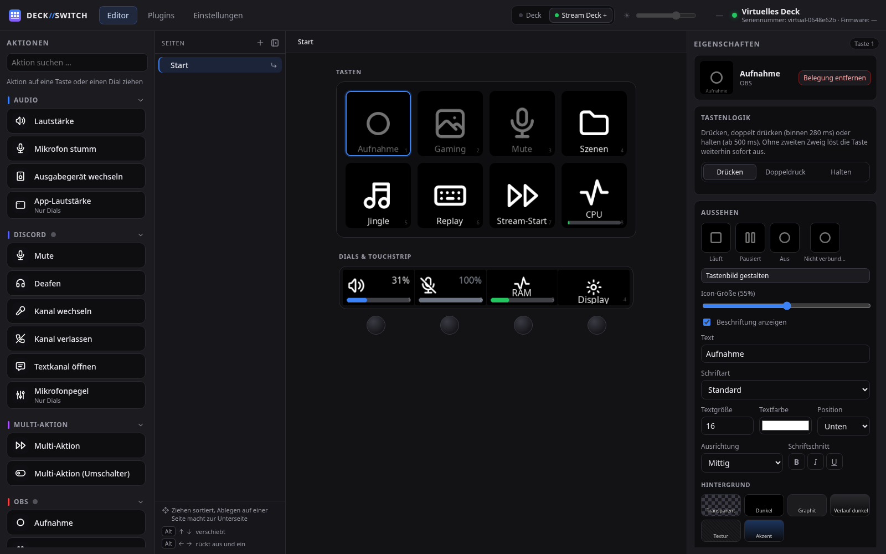
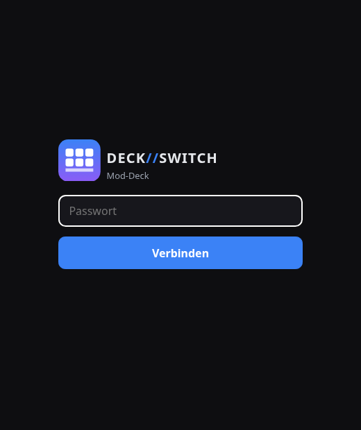
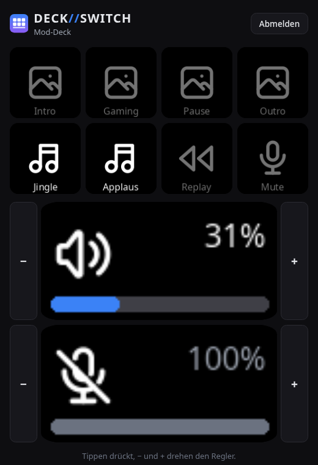
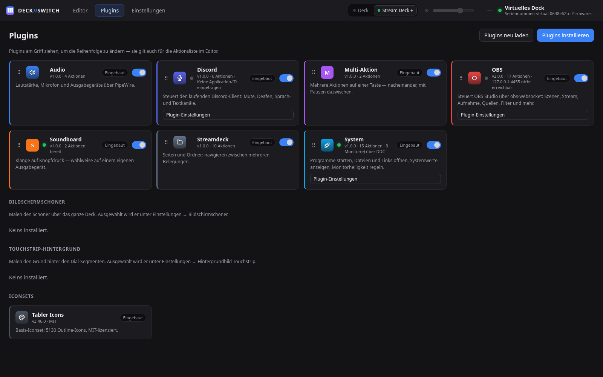
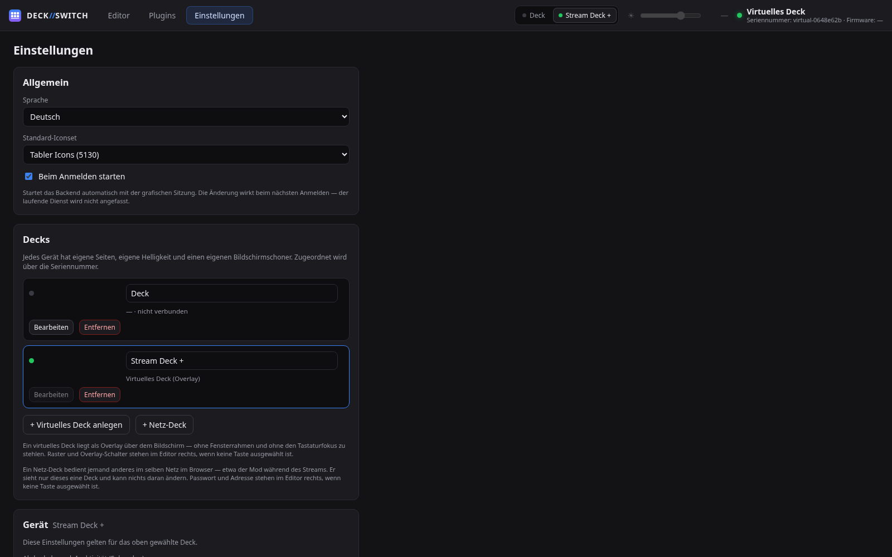

# DECK//SWITCH

**Eigenständige Steuerungssoftware für Elgato Stream Deck unter Linux** —
ohne Elgatos offizielle Software, mit eigenem Plugin-System.

*[English version](README.md)*

Entwickelt und am Gerät geprüft mit dem **Stream Deck +** auf **CachyOS /
Arch Linux** mit KDE Plasma unter Wayland.

> Der Name wird **DECK//SWITCH** geschrieben, die Schrägstriche in der
> Akzentfarbe. Technisch heißt alles `deckswitch` — Paket, Dienst,
> Konfigurationsordner.



---

## Was es kann

**Tasten und Dials**
Drei Aktionen pro Taste: Drücken, Doppeldruck, Halten. Dials regeln stufenlos
oder lösen je Drehrichtung eine eigene Aktion aus; mehrere Belegungen können
sich einen Dial teilen (Dial-Stack). Wischen über den Touchstrip blättert
durch die Seiten.

**Seiten und Ordner**
Beliebig tiefer Seitenbaum, per Drag & Drop sortierbar. Ordner sind keine
eigene Sache, sondern schlicht Unterseiten.

**Multi-Aktionen**
Mehrere Schritte nacheinander, mit Pausen als eigenständigen Schritten,
einzeln abschaltbar, wahlweise in Schleife. Dazu ein Umschalter mit zwei
Ketten und eigenem Symbol je Richtung.

**Aussehen**
Symbol, Beschriftung (Schriftart, Schnitt, Größe, Farbe, Ausrichtung) und
Hintergrund (Farbe, Verlauf, Textur, Bild) je Taste. Animierte GIFs laufen
auf der Taste ab. Eine eingebaute Werkstatt gestaltet fertige Tastenbilder.
Gerendert wird immer im Backend — die Vorschau zeigt exakt das, was auf dem
Gerät steht.

**Mehrere Decks**
Beliebig viele Geräte gleichzeitig, jedes mit eigenem Profil, eigener
Helligkeit und eigenen Zeiten. Zugeordnet über die Seriennummer.

**Virtuelles Deck**
Ein Deck als Overlay auf dem Bildschirm, mit frei wählbarem Raster — ohne
Fensterrahmen, ohne Eintrag in Alt-Tab und ohne den Tastaturfokus zu
stehlen. Frei platzierbar, die Stelle wird gemerkt. Per **globalem
Kurzbefehl** von überall herbeizurufen.

**Netz-Deck**
Ein Deck, das jemand anderes im selben Netz im Browser bedient — etwa der
Moderator während des Streams. Passwortgeschützt, nichts zu installieren,
und der Gast kann nichts verändern.

<p align="center">
  
  
</p>

**Bildschirmschoner und Hintergrundbilder**
Ein Motiv über alle Tasten und den Touchstrip, animiert oder still; je Seite
ein eigenes Hintergrundbild für den Touchstrip.

**Plugins**
Sieben eingebaute Plugins (Audio, OBS, Discord, System, Soundboard,
Multi-Aktion, Navigation), zwei nachinstallierbare (Spotify, Wetter) und
eine offene API für eigene. Iconsets sind ebenfalls Plugins.
Nachinstalliert wird aus einem ZIP, von einer Adresse oder über einen
`streamdeck://`-Link im Browser — ein **Marktplatz**, über den sich Plugins
direkt aus der App finden und installieren lassen, ist geplant.

**Plugin-Übersicht und Einstellungen**

<p align="center">
  
  
</p>

Einzelheiten: [Bedienung](docs/de/operation.md) ·
[Decks](docs/de/decks.md) · [Plugins](docs/de/plugins.md)

---

## Installation

Zielplattform sind **CachyOS und Arch Linux**. `setup.sh` setzt deshalb
`pacman` voraus und bricht auf anderen Distributionen mit einer Liste der
nötigen Pakete ab, statt eine Erkennung vorzutäuschen, die niemand testet.

### Aus dem AUR

Der paketierte Weg. Er legt die udev-Regel und die systemd-Unit dorthin, wo
sie hingehören — genau der Schritt, den man von Hand am ehesten vergisst:

```sh
paru -S deckswitch        # oder yay, oder makepkg aus packaging/aur/
systemctl --user enable --now deckswitch.service
```

Danach einmal in die Gruppe `input` eintragen (für die Aktionen
*Tastenkombination* und *Text tippen*) und neu anmelden:

```sh
sudo usermod -aG input "$USER"
```

### Aus dem Repo

Zum Mitentwickeln oder für einen Stand, der neuer ist als die Freigabe:

```sh
git clone https://github.com/LabRaTox/Deck-Switch.git
cd Deck-Switch
./scripts/setup.sh          # Pakete, venv, GUI-Build, udev-Regel
./scripts/start-backend.sh  # Backend starten
```

Die Oberfläche liegt dann unter <http://127.0.0.1:8770> — oder als eigenes
Fenster:

```sh
./scripts/start-gui.sh
```

### Pakete von Hand

`setup.sh` prüft sie selbst und bietet an, fehlende zu installieren:

```sh
sudo pacman -S --needed python webkit2gtk-4.1 base-devel rust hidapi libusb \
    nodejs npm noto-fonts wireplumber libpulse libxkbcommon pipewire-audio \
    qt6-declarative layer-shell-qt cairo
```

### Gerätezugriff (udev)

Ohne udev-Regel gehört der HID-Knoten root, das Gerät wäre also nur mit root
ansprechbar. `setup.sh` bietet die Installation an; von Hand:

```sh
sudo install -m 644 packaging/70-streamdeck.rules /etc/udev/rules.d/
sudo udevadm control --reload-rules
sudo udevadm trigger --subsystem-match=usb --subsystem-match=hidraw
```

Danach den Stream Deck einmal ab- und wieder anstecken.

Dieselbe Regel richtet den Zugriff auf `/dev/uinput` ein — die virtuelle
Tastatur, über die **Tastenkombination** und **Text tippen** laufen. Dafür
muss der Benutzer in der Gruppe `input` sein:

```sh
groups | grep -q input || sudo usermod -aG input "$USER"
```

Die Gruppenmitgliedschaft greift erst nach dem nächsten Anmelden. Ob es
klappt, sagt die Oberfläche: In den Einstellungen einer Hotkey-Aktion steht
sonst im Klartext, was fehlt.

### Beim Anmelden starten

Am einfachsten über den Schalter **Beim Anmelden starten** in den
Einstellungen. Er legt den systemd-Dienst an und schaltet ihn ein bzw. aus.
Dasselbe von der Kommandozeile:

```sh
./scripts/install-service.sh            # einrichten
./scripts/install-service.sh --remove   # wieder entfernen
```

---

## Aufgebaut auf

| | |
| --- | --- |
| **Backend** | Python 3, [`streamdeck`](https://github.com/abcminiuser/python-elgato-streamdeck), FastAPI |
| **GUI** | Tauri + Vite/React (System-WebView statt gebündeltem Chromium) |
| **Audio** | PipeWire über `wpctl`/`pactl`, Soundboard über `pw-play` |
| **Eingaben** | virtuelle Tastatur über `/dev/uinput`, Belegung über libxkbcommon |
| **Desktop** | MPRIS und KDEs globale Kurzbefehle über D-Bus |
| **Overlay** | `zwlr_layer_shell_v1` über layer-shell-qt |
| **Icons** | [Tabler Icons](https://tabler.io/icons) (MIT), eingebunden als ganz normales Iconset-Plugin |

Ohne [`python-elgato-streamdeck`](https://github.com/abcminiuser/python-elgato-streamdeck)
von Dean Camera gäbe es dieses Projekt nicht — die gesamte
Geräteanbindung ruht darauf.

## Dokumentation

Alles zweisprachig — [`docs/de/`](docs/de/) und [`docs/en/`](docs/en/).

| | |
| --- | --- |
| [Bedienung](docs/de/operation.md) | Editor, Tastenlogik, Multi-Aktionen, Dials, Aussehen |
| [Decks](docs/de/decks.md) | mehrere Geräte, virtuelles Deck, Netz-Deck |
| [Plugins](docs/de/plugins.md) | eingebaute und nachinstallierbare, Installation |
| [Eigene Plugins schreiben](docs/de/plugin-development.md) | die Plugin-API |
| [Discord einrichten](docs/de/discord-setup.md) | einmalige Einrichtung |
| [Aufbau und Entwicklung](docs/de/development.md) | Projektstruktur, Tests, Sicherheit, Grenzen |

## Lizenz

[MIT](LICENSE) — Heiko Stuhrmann.

Tabler Icons stehen ebenfalls unter der MIT-Lizenz
(`backend/plugins/iconset-tabler/LICENSE`).

Dieses Projekt steht in keiner Verbindung zu Elgato oder Corsair.
„Stream Deck" ist eine Marke der Corsair Memory, Inc.
